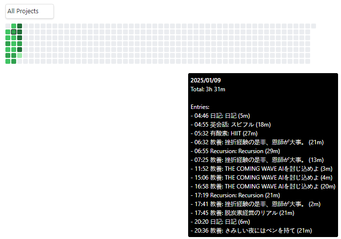

# Obsidian toggl track contribution Plugin

This is a plugin for Obsidian (https://obsidian.md).

This project developped from sample plugin (https://github.com/obsidianmd/obsidian-sample-plugin). Used TypeScript to provide type checking and documentation.
The repo depends on the latest plugin API (obsidian.d.ts) in TypeScript Definition format, which contains TSDoc comments describing what it does.

This sample plugin visualize your toggl track data in contribution graph.

## How to use

- Clone this repo.
- Make sure your NodeJS is at least v16 (`node --version`).
- `npm i` or `yarn` to install dependencies.
- `npm run dev` to start compilation in watch mode.

## Manually installing the plugin

- Copy over `main.js`, `styles.css`, `manifest.json` to your vault `VaultFolder/.obsidian/plugins/your-plugin-id/`.